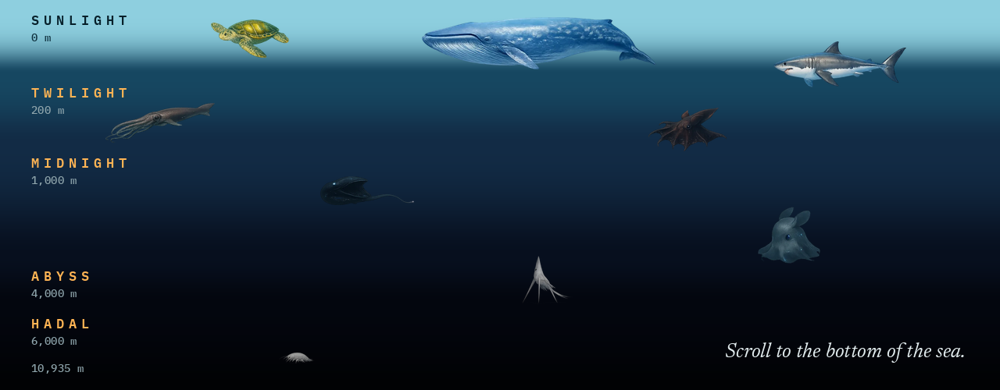

# Hadal

A scroll-driven descent from the ocean surface to the floor of the Challenger Deep, 10,935 metres down.

The page acts as the ocean. Scroll position maps to real depth. Light fades zone by zone, 43 real animals appear at the depths they actually live, and a fixed instrument panel reports live depth, pressure, temperature, and remaining light. The deeper you go, the emptier it gets.

Built with HTML, CSS, and vanilla JavaScript. No frameworks, no build step.

---

## Two problems worth solving

**Contrast.** The background travels from bright cyan at the surface to near-black in the trench, so no fixed text colour survives the full ramp. Interpolating the text colour with depth does not help either, because every colour ramp has a crossing point where the text and the water match. The answer turned out to be two different ones. The instrument panel and the creature captions sit on an opaque housing at `#0a0f11`, which holds a 10.9:1 contrast ratio for the amber text and 16:1 for the body ink at every depth, measured, with nothing to tune. The zone markers and landmark captions sit on the water itself, which only works because the 200m colour stop was darkened until amber clears 5.6:1 from Twilight down. The surface marker is the one place neither approach fits: amber on bright cyan measures 1.02:1, so it runs dark ink instead.

**Scale.** The dataset spans 556:1, from a 25 metre blue whale to a 4.5 centimetre amphipod. Standard size buckets could not carry that range. Scaling purely by length also looked wrong, because the eye compares rendered area rather than length. A 2.5 metre sunfish read as larger than a 16 metre sperm whale. Size is now derived from the geometric mean of width and height, with each crop's own aspect ratio divided back out, so every creature at a given step covers the same area whatever its shape. Positions are laid out by a seeded collision sweep, so the scatter is arbitrary but identical on every visit.

---

## Structure

| File | What it holds |
| --- | --- |
| `index.html` | Document shell and the instrument panel markup |
| `style.css` | Two materials: water and housing |
| `script.js` | Depth mapping, sizing, layout, and render loop |
| `data.js` | 43 creatures, 5 zone boundaries, and 5 landmarks |
| `creatures/` | 43 WebP sprites, 1.2MB total |

---

## Notes

A few quick notes on the data and accessibility. The depths listed are typical depths for each species, not their absolute maximums. The temperature curve is a labelled approximation, but the depths and facts are verified.

The creature visuals are illustrations rather than photographs. The drift animation is disabled under `prefers-reduced-motion` and only runs for creatures currently visible on screen. Every creature can also be focused with the Tab key to read what it is.
